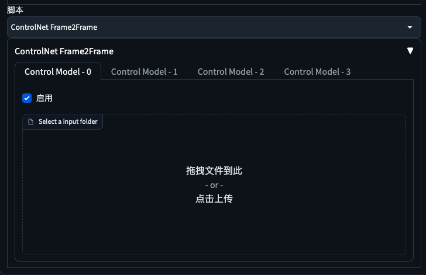

## stable-diffusion-controlnet-frame2frame

English | [简体中文](./README.md)

A small plug-in that allows StableDiffusion's ControlNet to support sequence frames (batch multi-map).

## Introduction

- A script supported by Stable Diffusion WebUI;
- Let ControlNet support sequence frame (batch multi-map);
- Similar to ControlNet Movie2Movie, except that M2M will compress the picture quality and lose details when uploading videos, while Frame2Frame will not.

## Usage

1. Download the [frame2frame.py](./frame2frame.py) file and copy it to the `./extensions/sd-webui-controlnet/scripts/` folder;
2. Settings - ControlNet - Check [Allow other scripts to control this extension];
3. Reset UI;

## Video Tutorial

[click watch video](https://sales.ws.126.net/minisite/2023/0510/1683706144_f2f.mp4)