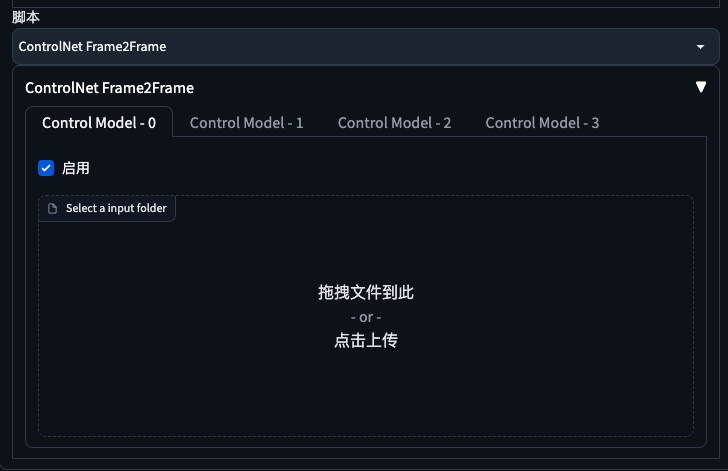

## stable-diffusion-controlnet-frame2frame

[English](./README.en.md)

一个让 StableDiffusion 的 ControlNet 支持序列帧（批量多图）的小插件。

## 简介

- 一个 Stable Diffusion WebUI 支持的脚本；
- 让 ControlNet 支持序列帧（批量多图）；
- 与 ControlNet Movie2Movie 类似，只是 M2M 上传视频时会压缩图片质量，损失细节，而 Frame2Frame 不会。

## 用法

1. 下载 [frame2frame.py](./frame2frame.py) 文件，复制到 `./extensions/sd-webui-controlnet/scripts/` 文件夹下；
2. 设置-ControlNet-勾选【允许其他脚本控制此扩展】；
3. 重载前端；

## 视频演示

https://github.com/ningbonb/stable-diffusion-controlnet-frame2frame/assets/19989328/90e4ac88-d2cf-45b7-b924-bbaa5a75dbdf
